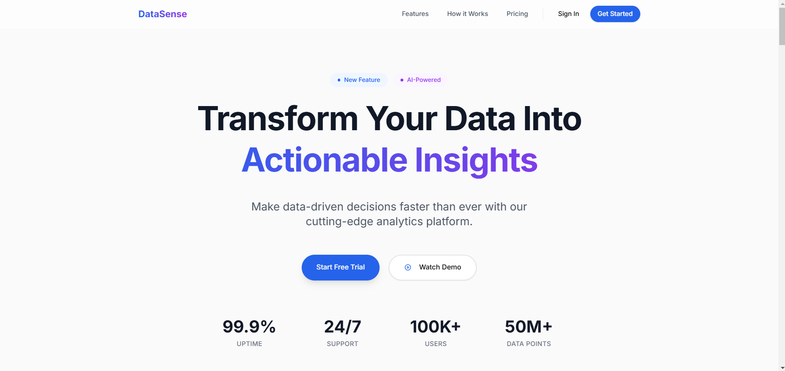

# Next.js SaaS Landing Page Template

A modern and open-source landing page template for SaaS products. Built with Next.js 14, Tailwind CSS, and Shadcn UI.



## 🚀 Live Demo

[View Demo](https://next-saas-landing.ethanjames.dev)

## ✨ Features

- 🎨 **Modern Design**: Clean, professional, and highly customizable interface
- 📱 **Fully Responsive**: Looks great on all devices (mobile, tablet, desktop)
- ⚡ **Performance Focused**: Optimized for speed and SEO
- 🛠️ **Built with Modern Stack**:
  - Next.js 14 (App Router)
  - TypeScript
  - Tailwind CSS
  - Shadcn UI Components
- 🎯 **Conversion Optimized**: Strategically designed sections and CTAs
- 🎨 **Beautiful Animations**: Smooth transitions and micro-interactions
- 📦 **Key Sections Included**:
  - Hero section with dual CTAs
  - Feature showcase
  - Social proof and metrics
  - Testimonials
  - Pricing plans
  - Feature comparison table
  - FAQ section
  - Integration showcase
  - Multiple call-to-action sections

## 🛠️ Getting Started

### Prerequisites

- Node.js 18+ 
- npm or yarn

### Installation

1. Clone the repository:
```bash
git clone https://github.com/etjamesdev/next-saas-landing.git
```

2. Navigate to the project:
```bash
cd next-saas-landing
```

3. Install dependencies:
```bash
npm install
# or
yarn install
```

4. Start the development server:
```bash
npm run dev
# or
yarn dev
```

5. Open [http://localhost:3000](http://localhost:3000) in your browser.

## 🎨 Customization

### Branding & Colors

1. Update the color scheme in `tailwind.config.js`:
```js
theme: {
  extend: {
    colors: {
      // Add your brand colors
    }
  }
}
```

2. Modify the gradient styles in `src/app/page.tsx`

### Content

1. Update the main content in `src/app/page.tsx`
2. Modify sections:
   - Features
   - Testimonials
   - Pricing plans
   - FAQ
   - Integration logos

### Components

All UI components are built with Shadcn UI, making them easy to customize and extend.

## 📁 Project Structure

```
├── src/
│   ├── app/
│   │   ├── layout.tsx      # Root layout
│   │   ├── page.tsx        # Landing page
│   │   └── globals.css     # Global styles
│   ├── components/
│   │   └── ui/            # Shadcn UI components
│   └── styles/
└── public/
    └── images/            # Static images
```

## 📱 Responsive Design

The template is fully responsive with four main breakpoints:
- Mobile: 0-640px
- Tablet: 641-1024px
- Desktop: 1025-1280px
- Large Desktop: 1281px+

## ⚡ Performance

- Optimized images
- Minimal JavaScript
- Efficient CSS with Tailwind
- Core Web Vitals optimized

## 🤝 Contributing

Contributions are welcome! Please feel free to submit a Pull Request.

1. Fork the repository
2. Create your feature branch (`git checkout -b feature/AmazingFeature`)
3. Commit your changes (`git commit -m 'Add some AmazingFeature'`)
4. Push to the branch (`git push origin feature/AmazingFeature`)
5. Open a Pull Request

## 📝 License

This project is licensed under the MIT License - see the [LICENSE](LICENSE) file for details.

## 💫 Credits

- [Next.js](https://nextjs.org/)
- [Tailwind CSS](https://tailwindcss.com/)
- [Shadcn UI](https://ui.shadcn.com/)
- [Heroicons](https://heroicons.com/)

## 🌟 Support

If you find this template helpful, please consider:
- Giving it a ⭐️ on GitHub
- Sharing it with others


Project Link: [https://github.com/etjamesdev/next-saas-landing](https://github.com/etjamesdev/next-saas-landing)
